*Bem-vindo ao ano de 2912, onde suas habilidades em ciência de dados são necessárias para resolver um mistério cósmico. Recebemos uma transmissão de quatro anos-luz de distância e as coisas não parecem boas.*

*A espaçonave Titanic foi um transatlântico interestelar lançado há um mês. Com quase 13.000 passageiros a bordo, a embarcação partiu em sua viagem inaugural transportando emigrantes de nosso sistema solar para três exoplanetas recém-habitáveis orbitando estrelas próximas.*

*Ao contornar Alpha Centauri a caminho de seu primeiro destino - o tórrido 55 Cancri E - a incauta nave espacial Titanic colidiu com uma anomalia do espaço-tempo escondida dentro de uma nuvem de poeira. Infelizmente, ele teve um destino semelhante ao de seu homônimo de 1000 anos antes. Embora a nave tenha permanecido intacta, quase metade dos passageiros foram transportados para uma dimensão alternativa!*

*Para ajudar as equipes de resgate e recuperar os passageiros perdidos, você é desafiado a prever quais passageiros foram transportados pela anomalia usando registros recuperados do sistema de computador danificado da espaçonave.*

*Ajude a salvá-los e mude a história!*

O conjunto de dados **"Space Titanic"** disponível no [Kaggle](https://www.kaggle.com/competitions/spaceship-titanic/data) é uma coleção de informações sobre uma hipotética tragédia espacial em uma nave chamada "Starship Titanic" e sua tarefa é prever se um passageiro foi transportado para uma dimensão alternativa durante a colisão da espaçonave com a anomalia do espaço-tempo. Para ajudá-lo a fazer essas previsões, você recebe um conjunto de registros pessoais recuperados do sistema de computador danificado da nave.


## Sobre os dados

O conjunto de dados refere-se aos registros pessoais de cerca de 8700 passageiros, mensurados nas seguintes características:

-   **PassengerId** - Um ID exclusivo para cada passageiro. Cada Id assume a forma *gggg_pp* onde *gggg* indica um grupo com o qual o passageiro está viajando e *pp* é seu número dentro do grupo. As pessoas em um grupo geralmente são membros da família, mas nem sempre.

-   **HomePlanet** - O planeta do qual o passageiro partiu, normalmente seu planeta de residência permanente.

-   **CryoSleep** - Indica se o passageiro optou por ser colocado em animação suspensa durante a viagem. Os passageiros em sono criogênico estão confinados em suas cabines.

-   **Cabine** - O número da cabine onde o passageiro está hospedado. Assume a forma *deck/num/side*, onde *side* pode ser *P* para bombordo ou *S* para estibordo.

-   **Destination** - O planeta para o qual o passageiro irá desembarcar.

-   **Idade** - A idade do passageiro.

-   **VIP** - Se o passageiro pagou pelo serviço VIP especial durante a viagem.

-   **RoomService**, **FoodCourt**, **ShoppingMall**, **Spa**, **VRDeck** - Valor que o passageiro pagou em cada uma das muitas comodidades de luxo do Titanic.

-   **Nome** - O nome e o sobrenome do passageiro.

-   **Transported** - Se o passageiro foi transportado para outra dimensão. Este é o alvo, a coluna que você está tentando prever.

Apesar desse conjunto de dados destinar-se ao aprendizado de máquina supervisionado, faremos, neste *script*, apenas a parte de pré-processamento, incluindo algumas análises exploratórias. Tentaremos responder às seguintes questões:

  - De onde vieram os passageiros e qual a relação disso com ser transportado ou não?
  - Em que cabine estavam os passageiros e qual a relação disso com ser transportado ou não?
  - Para onde iriam os passageiros e qual a relação disso com ser transportado ou não?
  - Quem estava sozinho e quem estava em grupo?
  - Estar em sono profundo era uma boa ideia?
  - Passageiros VIP tem menor risco de ser transportado?     
  - Que fatores ajudaram alguém a não ser transportado?

## Pacotes utilizados

```{r, message=FALSE, warning=FALSE}
load <- function(pkg){
  new.pkg <- pkg[!(pkg %in% installed.packages()[, "Package"])]
  if (length(new.pkg))
    install.packages(new.pkg, dependencies = TRUE)
  sapply(pkg, require, character.only = TRUE)
} 

## Pacotes utilizados nessa análise

packages <- c("tidyverse",'tidymodels', 'janitor', 'ggpubr', 'funModeling', 'ggalluvial', 'vip', 'skimr', 'VIM', 'patchwork', 'rio', 'htmlwidgets', 'visNetwork', 'arulesViz', 'discrim', 'kknn', 'Metrics', 'usethis')

load(packages)
```

## Leitura dos dados
 
```{r}
dados = rio::import("https://raw.githubusercontent.com/tiagomartin/est125/refs/heads/main/dados/space_titanic.csv")
dados %>% 
  glimpse()
```

```{r}
dados %>% df_status()
```

Podemos observar que, com exceção das variáveis **PassengerId** e **Transported**, todas as outras possuem dados ausentes, representando, em cada uma delas, aproximadamente 2,5% das observações.


## Explorando os dados

Na própria apresentação da base de dados, na descrição das variáveis, foi informado que o atributo **PassengerId** assume a forma *gggg_pp* onde *gggg* indica um grupo com o qual o passageiro está viajando e *pp* é seu número dentro do grupo. Dessa forma, vamos criar duas novas variáveis, **PassGroup** para o grupo e **nGroup** para o número do passageiro no grupo.

```{r message=FALSE, warning=FALSE}
dados = dados %>%
  separate(PassengerId, c("PassGroup", "nGroup"), sep = "_", remove = FALSE) %>% 
  mutate(PassGroup = as.numeric(PassGroup))
```

Outra variável que possui mais de uma informação embutida é a variável **Cabin**. Vamos separá-la em **CabinDeck**, representando o *deck* da cabine, podendo assumir os valores A, B, C, D, E, F e T, e **CabinSide**, podendo assumir os valores P para bombordo e S para estibordo. Também criaremos a variável **CabinNum**, que representa os números das cabines.

```{r message=FALSE, warning=FALSE}
dados = dados %>%
  separate(Cabin, c("CabinDeck", "CabinNum", "CabinSide"), sep = "/") %>% 
  mutate(CabinDeck = as.factor(CabinDeck),
         CabinSide = as.factor(CabinSide))
```

A função `ggscatmat()` é uma função do pacote `GGally` do R que cria uma matriz de gráficos de dispersão para visualizar a relação entre várias variáveis numéricas em um conjunto de dados. Essa função é útil para visualizar rapidamente as correlações entre as variáveis, bem como para detectar padrões e tendências. No gráfico abaixo, ainda separamos os elementos de acordo com a sua classe, descrita pela variável **Transported**.

```{r message=FALSE, warning=FALSE}
p = dados %>% 
      mutate(Transported = as.numeric(Transported)) %>% 
      select_if(is.numeric) %>% 
      GGally::ggscatmat(color = "Transported", corMethod = "pearson")+
      theme_pubclean()
```

```{r, echo=FALSE,message=FALSE, warning=FALSE}
ggsave("../images/graf01.png", p)
```


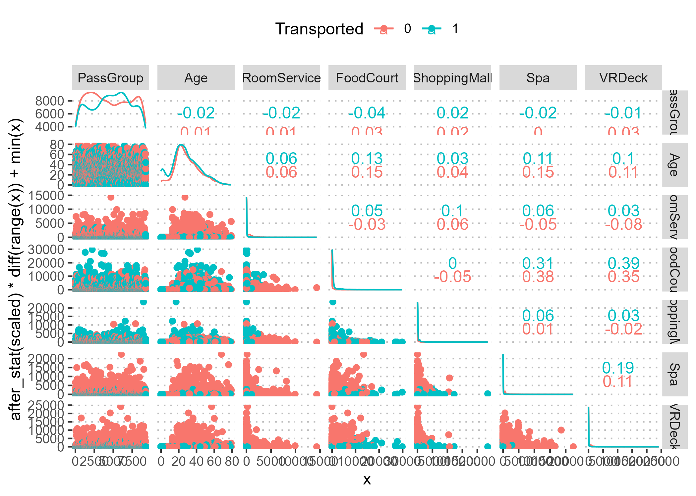


Note que fica clara a necessidade de transformações para as variáveis **RoomService**, **FoodCourt**, **ShoppingMall**, **Spa** e **VRDeck**, devido à sua distribuição assimétrica. Um fato interessante acontece com a variável **Age**:

```{r message=FALSE, warning=FALSE}
# Age 
p = dados %>% 
      ggplot(aes(x=Age, fill = Transported))+
      geom_density(alpha =0.5)+
      theme(legend.position='bottom')
```


```{r, echo=FALSE,message=FALSE, warning=FALSE}
ggsave("../images/graf02.png", p)
```


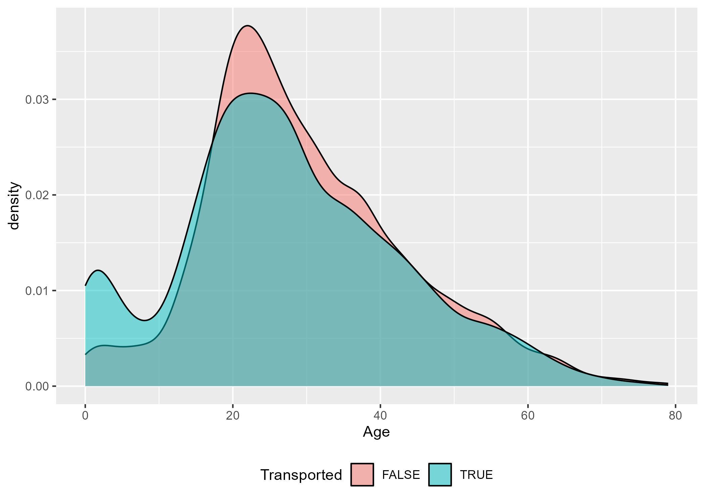

Observe que, para passageiros com idade menor de 10 anos, aproximadamente, a probabilidade do passageiro ser transportado é maior que não ser transportado. Isso sugere, talvez, a criação de um atributo captando essa informação.

### De onde vieram os passageiros e qual a relação disso com ser transportado ou não?

```{r message=FALSE, warning=FALSE}
p = dados %>% 
      ggplot(aes(x=HomePlanet))+
      geom_bar(stat = "count", fill="steelblue")
```


```{r, echo=FALSE,message=FALSE, warning=FALSE}
ggsave("../images/graf03.png", p)
```


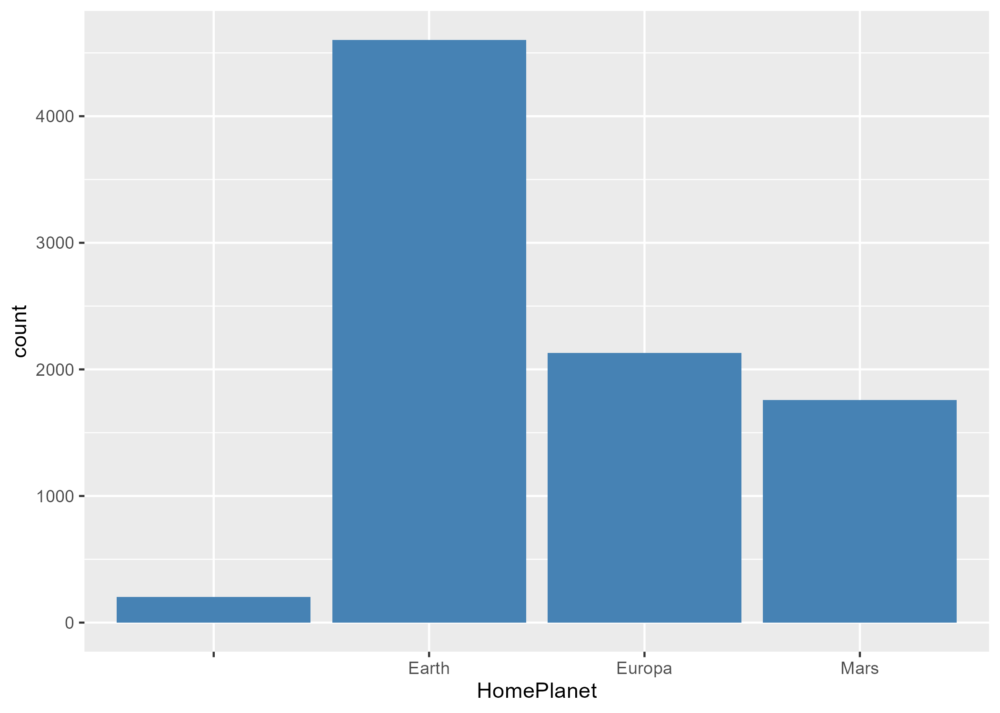


Note que a maioria dos passageiros embarcaram na Terra (Earth). Além disso, existem observações ausentes. Qual a relação da origem dos passageiros com o fato de ser transportado ou não?

```{r message=FALSE, warning=FALSE}
p = dados %>% 
      ggplot(aes(x=HomePlanet, fill = Transported))+
      geom_bar(stat = "count")+
      theme(legend.position='bottom')
```

```{r, echo=FALSE,message=FALSE, warning=FALSE}
ggsave("../images/graf04.png", p)
```


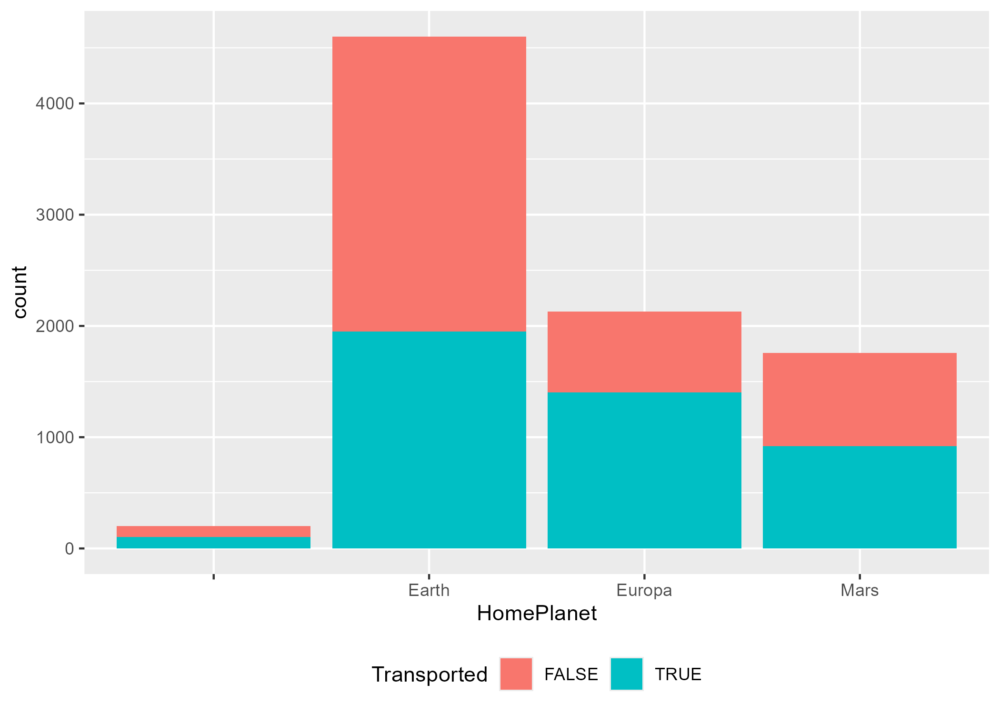

Quem veio da Terra tem menos chances de ser transportado?

## Em que cabine estavam os passageiros e qual a relação disso com ser transportado ou não?

```{r message=FALSE, warning=FALSE}
p1 = dados %>% 
  ggplot((aes(x=CabinDeck))) +
  geom_bar(stat = 'count', fill= 'steelblue')

p2 = dados %>% 
  ggplot((aes(x=CabinSide))) +
  geom_bar(stat = 'count', fill= 'steelblue')
```


```{r, echo=FALSE,message=FALSE, warning=FALSE}
ggsave("../images/graf05.png", p1 + p2)
```


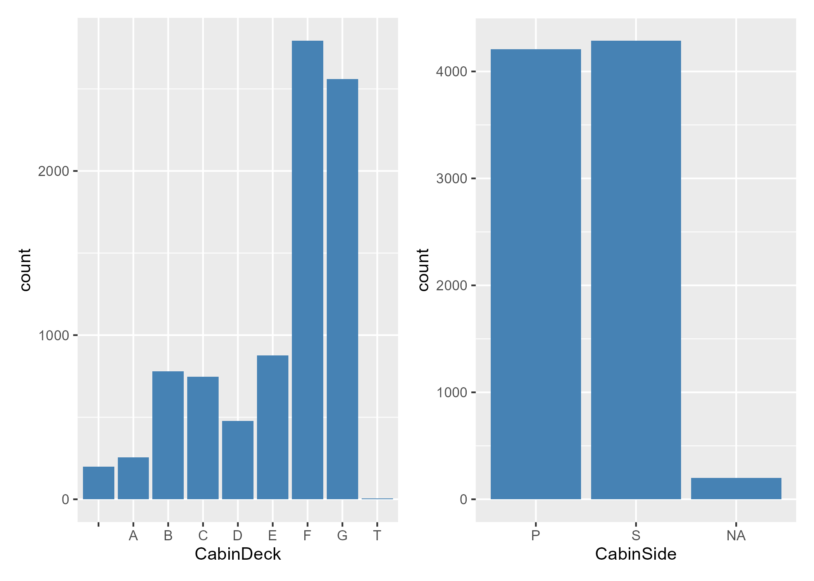


A maioria dos passageiros estavam alocados nos decks F e G. Existem observações faltantes. Os passageiros foram alocados em ambos os lados (estibordo e bombordo) de forma semelhante. Qual a relação disso com ser transportado ou não?

```{r message=FALSE, warning=FALSE}
p1 = dados %>% 
  ggplot((aes(x=CabinDeck, fill = Transported))) +
  geom_bar(stat = 'count')

p2 = dados %>% 
  ggplot((aes(x=CabinSide, fill = Transported))) +
  geom_bar(stat = 'count')

p = p1 + p2 + plot_layout(guides = "collect") 
```


```{r, echo=FALSE,message=FALSE, warning=FALSE}
ggsave("../images/graf06.png", p)
```


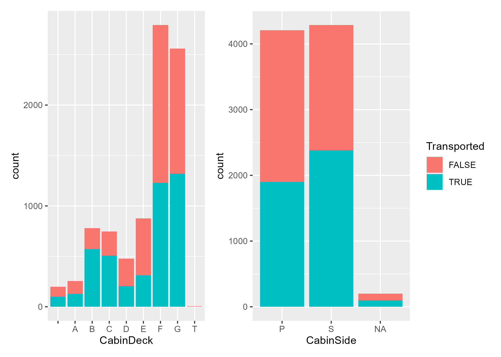


Aparentemente, quem está alocando nos decks B e C tem mais chance de ser transportado. O mesmo acontece para quem está situado no estibordo.

## Para onde iriam os passageiros e qual a relação disso com ser transportado ou não?

```{r message=FALSE, warning=FALSE}
p = dados %>% 
      ggplot((aes(x=Destination))) +
      geom_bar(stat = 'count', fill= 'steelblue')
```

```{r, echo=FALSE,message=FALSE, warning=FALSE}
ggsave("../images/graf07.png", p)
```


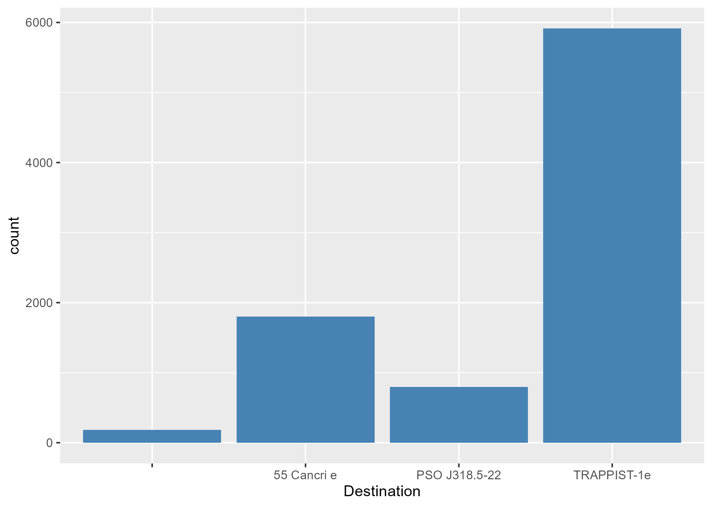


A maioria dos passageiros tinham como destino o Planeta "TRAPPIST-1e". Qual a relação disso com ser transportado ou não?

```{r message=FALSE, warning=FALSE}
p = dados %>% 
      ggplot((aes(x=Destination, fill= Transported))) +
      geom_bar(stat = 'count')+
      theme(legend.position='bottom')
```

```{r, echo=FALSE,message=FALSE, warning=FALSE}
ggsave("../images/graf08.png", p)
```


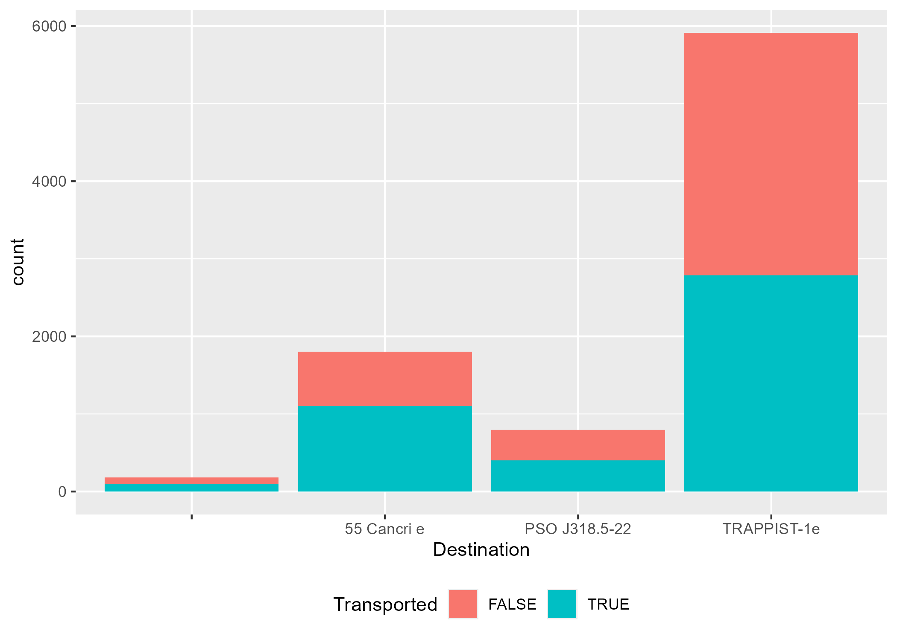

Quem iria para o Planeta "55 Cancri e" teria mais chances de ser transportado?

## Quem estava sozinho e quem estava em grupo?


```{r message=FALSE, warning=FALSE}
p = dados %>% add_count(PassGroup, name = "GroupSize") %>% 
      mutate(IsAlone = ifelse(GroupSize==1, 'yes', 'no')) %>% 
      ggplot(aes(x=IsAlone))+
      geom_bar(stat = "count", fill= 'steelblue')
```

```{r, echo=FALSE,message=FALSE, warning=FALSE}
ggsave("../images/graf09.png", p)
```


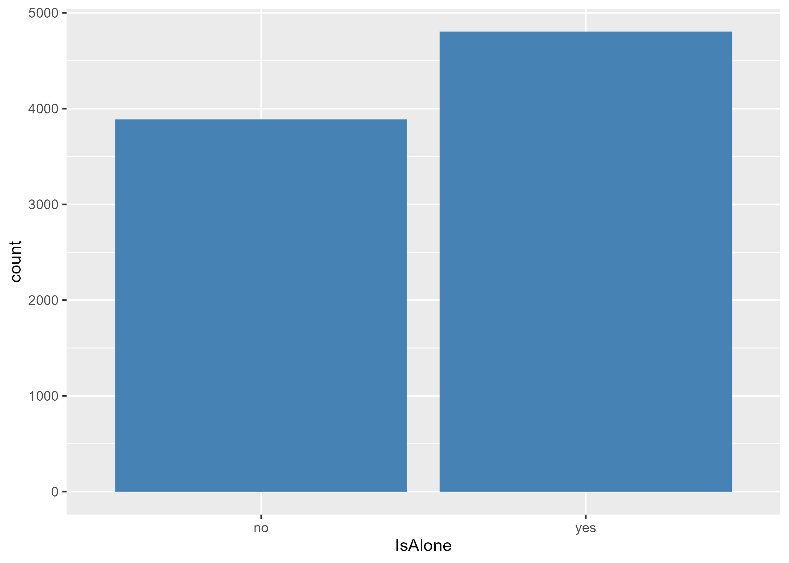


A maioria dos passageiros estavam viajando sozinho. Viajar sozinho influencia no fato de ser transportado?

```{r message=FALSE, warning=FALSE}
p = dados %>% add_count(PassGroup, name = "GroupSize") %>% 
      mutate(IsAlone = ifelse(GroupSize==1, 'yes', 'no')) %>% 
      ggplot(aes(x=IsAlone, fill= Transported))+
      geom_bar(stat = "count")+
      theme(legend.position='bottom')
```

```{r, echo=FALSE,message=FALSE, warning=FALSE}
ggsave("../images/graf10.png", p)
```


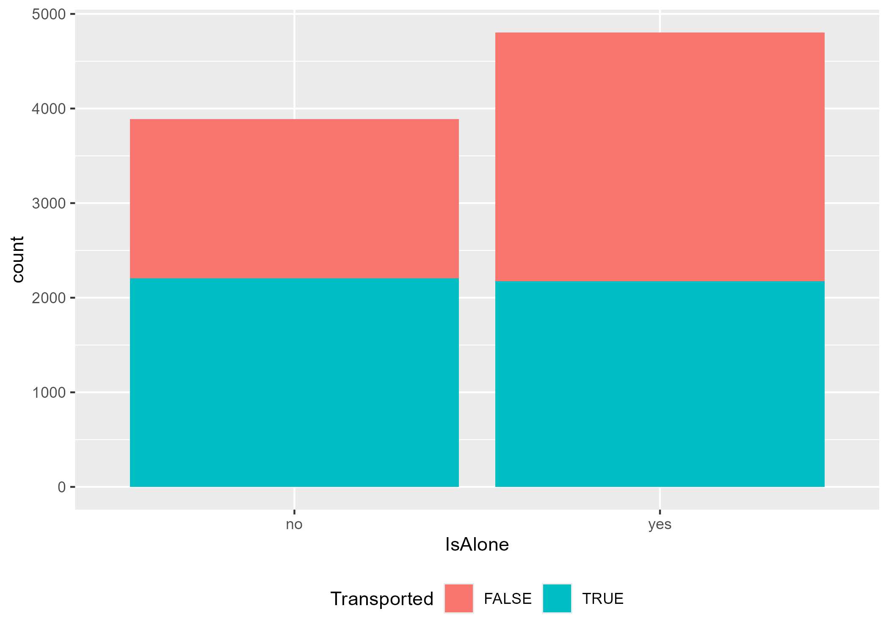


Talvez seja uma boa estar sozinho neste momento! 😃

## Estar em sono profundo era uma boa ideia?

{.nostretch fig-align="center" width="1000px"}


```{r message=FALSE, warning=FALSE}
p = dados %>% 
      ggplot(aes(x=CryoSleep))+
      geom_bar(stat = "count", fill= 'steelblue')
```

```{r, echo=FALSE,message=FALSE, warning=FALSE}
ggsave("../images/graf11.png", p)
```


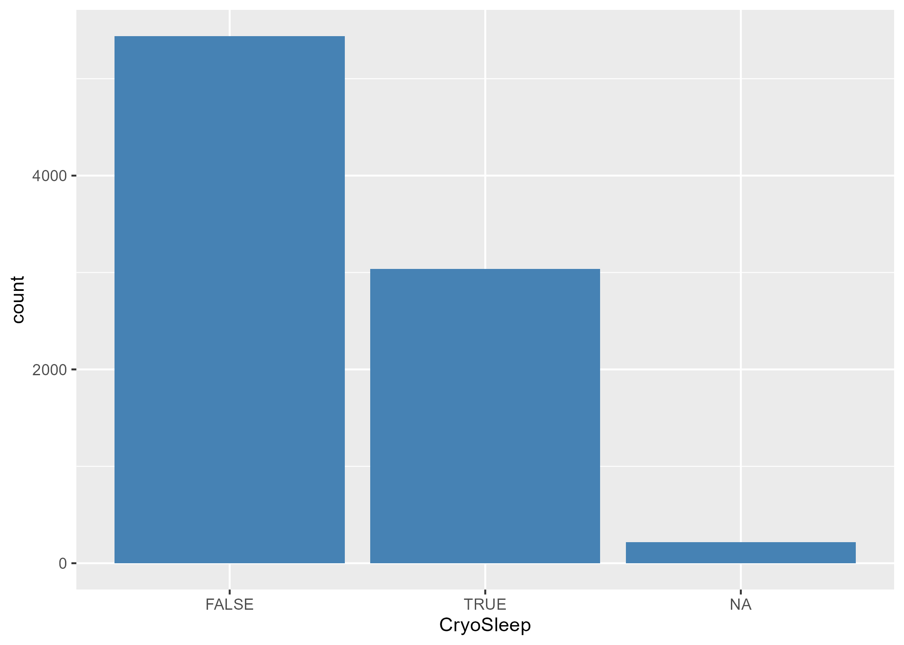

 
A maioria dos passageiros não estavam em sono profundo. Isso influenciou no fato de ser transportado? 

```{r message=FALSE, warning=FALSE}
p = dados %>% 
      ggplot(aes(x=CryoSleep, fill= Transported))+
      geom_bar(stat = "count")+
      theme(legend.position='bottom')
```


```{r, echo=FALSE,message=FALSE, warning=FALSE}
ggsave("../images/graf12.png", p)
```


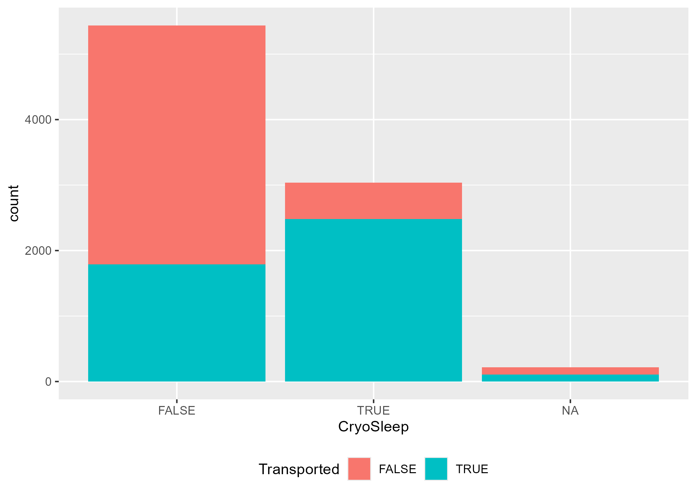


Estar em sono profundo não me pereceu ser uma boa ideia!


## Passageiros VIP tem menor risco de ser transportado?

```{r message=FALSE, warning=FALSE}
p = dados %>% 
      ggplot(aes(x=VIP))+
      geom_bar(stat = "count", fill= 'steelblue')
```


```{r, echo=FALSE,message=FALSE, warning=FALSE}
ggsave("../images/graf13.png", p)
```


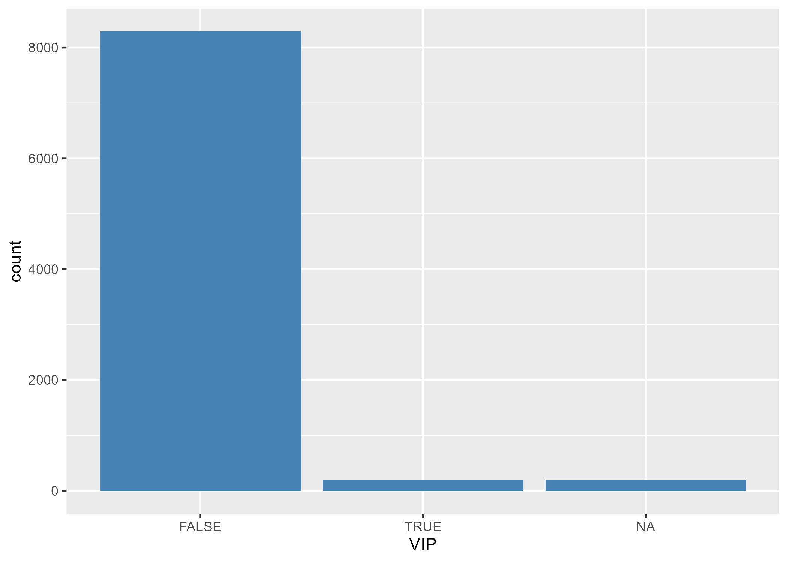

A grande maioria dos passageiros não eram VIPs. Isso influenciou no fato de ser transportado?

```{r message=FALSE, warning=FALSE}
p = dados %>% 
      ggplot(aes(x=VIP, fill= Transported))+
      geom_bar(stat = "count")+
      theme(legend.position='bottom')
```


```{r, echo=FALSE,message=FALSE, warning=FALSE}
ggsave("../images/graf14.png", p)
```


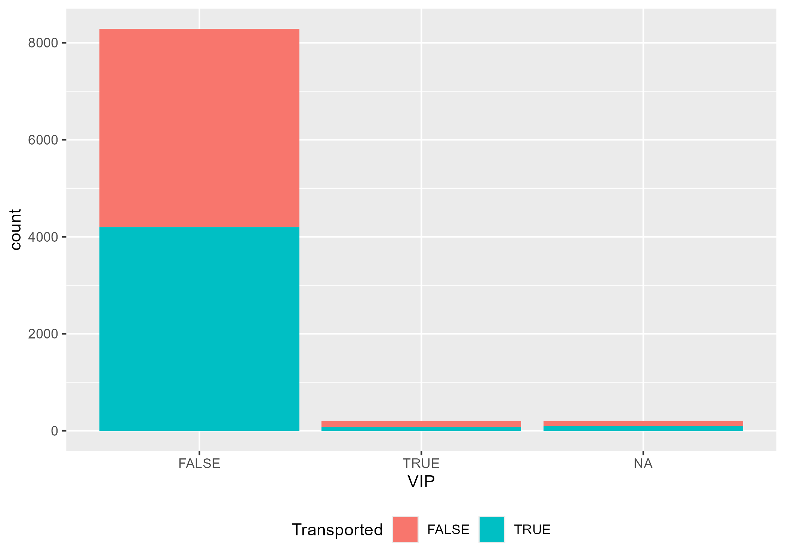


O fato de ser VIP aparentemente não possui relação com o fato de ser transportado!

## Que fatores ajudaram alguém a não ser transportado?

Vamos analisar os gastos dos passageiros.

```{r message=FALSE, warning=FALSE}
# RoomService 
p1 = dados %>% 
  mutate(RoomService = log10(RoomService)) %>% 
  ggplot(aes(x=RoomService, fill = Transported))+
  geom_density(alpha =0.5) 

# Spa 
p2 = dados %>% 
  mutate(Spa = log10(Spa)) %>% 
  ggplot(aes(x=Spa, fill = Transported))+
  geom_density(alpha =0.5) 

# VRDeck 
p3 = dados %>% 
  mutate(VRDeck = log10(VRDeck)) %>% 
  ggplot(aes(x=VRDeck, fill = Transported))+
  geom_density(alpha =0.5)

 
```

```{r, echo=FALSE,message=FALSE, warning=FALSE}
ggsave("../images/graf15.png", p1 + p2 + p3 + plot_layout(guides = "collect"))
```


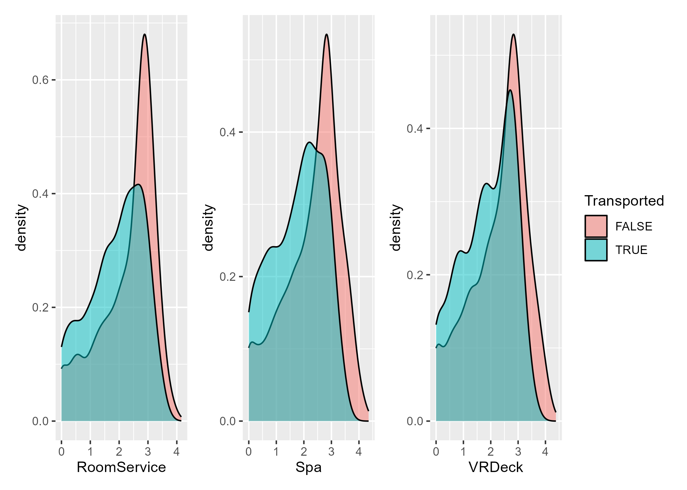


Gastos com RoomService, Spa e VRDeck aumentam a chance do passageiro não ser transportado!

```{r message=FALSE, warning=FALSE}
# FoodCourt
p1 = dados %>% 
  mutate(FoodCourt = log10(FoodCourt)) %>% 
  ggplot(aes(x=FoodCourt, fill = Transported))+
  geom_density(alpha =0.5)

# ShoppingMall
p2 = dados %>% 
  mutate(ShoppingMall = log10(ShoppingMall)) %>% 
  ggplot(aes(x=ShoppingMall, fill = Transported))+
  geom_density(alpha =0.5)
```

```{r, echo=FALSE,message=FALSE, warning=FALSE}
ggsave("../images/graf16.png", p1 + p2 + plot_layout(guides = "collect"))
```


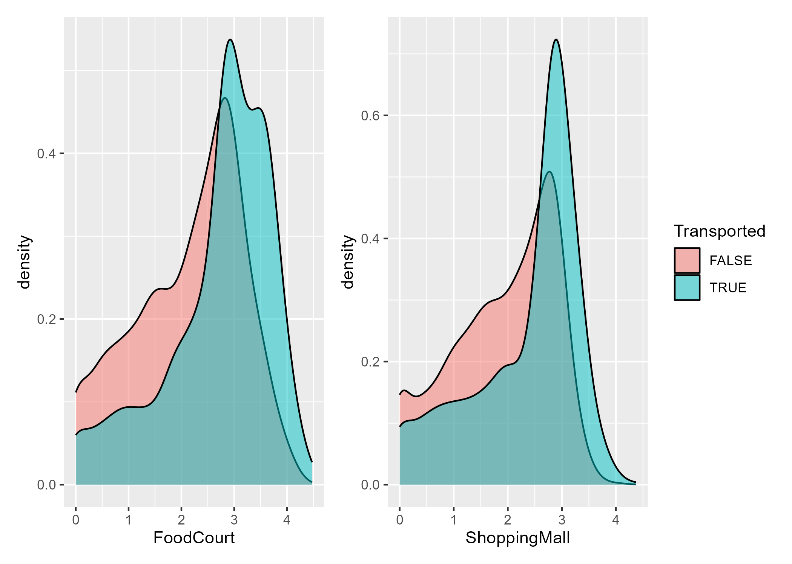

Já os gastos com FoodCourt e ShoppingMall aumentam a chance do passageiro ser transportado. Outra informação interessante pode ser obtida quando analisamos as variáveis HomePlanet e CryoSleep.


```{r message=FALSE, warning=FALSE}
# HomePlanet e CryoSleep
p = dados %>% 
      ggplot(aes(x=HomePlanet, fill= Transported))+
      geom_bar(stat = "count")+
      facet_grid(~CryoSleep)+
      theme(legend.position='bottom')
```

```{r, echo=FALSE,message=FALSE, warning=FALSE}
ggsave("../images/graf17.png", p)
```


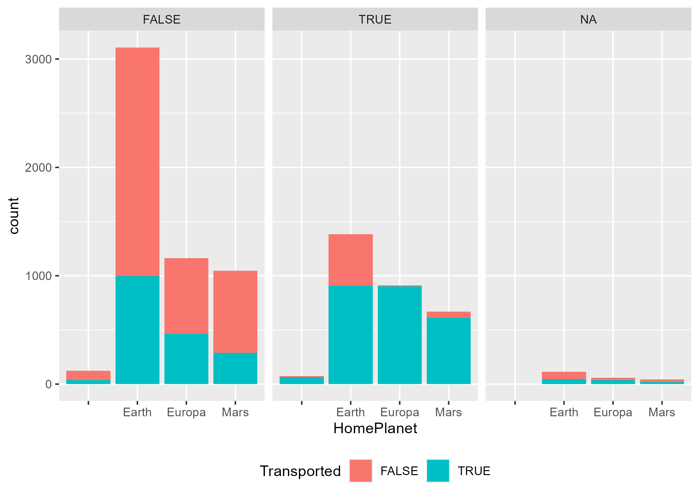


Note que, para os passageiros em suspensão profunda, o fato de não terem embarcados em Earth aumenta muito a chance de ser transportado para a dimesão alternativa! 


::: {.callout-note title="Resumindo..."}
Após a fase de exploração dos dados, algumas sugestões de _feature engineering_ foram aparecendo:

  - Criar uma variável indicando se o passageiro é menor de 14 anos, por exemplo;
  - Criar uma variável indicando se o passageiro é originário da Terra;
  - Criar uma variável indicando se o passageiro viajava sozinho;
  - Realizar transformação (raíz quadrada) nas variáveis RoomService, Spa, VRDeck, FoodCourt e ShoppingMall.
  - Criar uma variável com o total de "despesas supérfluas" (RoomService + Spa + VRDeck);
  - Criar uma variável com o total de "despesas básicas" (FoodCourt + ShoppingMall);
  
:::


Para evitar problema de vazamento de dados, o passo inicial de qualquer análise é separar o conjunto de treinamento, validação e teste: os dados de treinamento devem ser usados exclusivamente para treinar o modelo, enquanto os dados de validação e teste devem ser usados para avaliar sua performance. Isso evita que informações de teste ou validação sejam usadas para treinar o modelo e comprometam os resultados.


```{r}
set.seed(12345)
splits = dados %>% initial_split(strata = Transported)

dados_treino = training(splits)
dados_teste = testing(splits)
```

Criando a variável GroupSize apenas para o conjunto de dados de treinamento:

```{r}
dados_treino = dados_treino %>% add_count(PassGroup, name = "GroupSize") 
```


## Tratamento de dados faltantes

```{r}
dados_treino %>% df_status()
```

```{r}
miss = summary(aggr(dados_treino, sortVar=TRUE))$combinations
```

O gráfico acima mostra (à esquerda) mostra a proporção de _missing values_ para cada variável da base de dados e todas as combinações de valores ausentes (vermelho) e observados (azul) presentes nos dados (gráfico à direita). 

```{r}
head(miss[rev(order(miss[,2])),])
```

Note que, apesar de termos aproximadamente 2,5% de dados faltantes em cada variável, temos na base de dados aproximadamente 76% de casos completos, inviabilizando o descarte dessas observações incompletas.


::: {.callout-tip title="Dica"}
Um consenso entre especialistas é que, se uma variável tem mais de 20% de seus dados faltantes, talvez seja melhor excluí-la e entender as razões dos valores ausentes. Se a proporção de valores ausentes é menor do que isso, é possível preencher esses dados utilizando alguma técnica de imputação, dependendo do tipo de dado. Já quando há menos de 2% de valores faltantes, a exclusão desses registros pode ser uma opção, já que não afetará significativamente a base de dados.
:::

No entanto, é importante avaliar os efeitos do tratamento dos valores ausentes na análise e nos resultados finais, para garantir que as decisões tomadas sejam embasadas e coerentes com os objetivos do estudo. Esse processo deverá ser feito com parcimônia, sob pena de causar um viés de informação. A imputação pode introduzir viés de informação na medida em que os valores imputados podem não ser representativos da realidade ou podem não capturar a variabilidade dos dados ausentes.


::: {.callout-note title="Nota"}
Para realizar a imputação das variáveis usaremos as seguintes estratégias:

  - Para as variáveis **CryoSleep**, **RoomService**, **FoodCourt**, **ShoppingMall**, **Spa** e **VRDeck**: Se CryoSleep é _missing_ e pelo menos uma das variáveis de gastos for maior que zero, então imputaremos CryoSleep como FALSE (Se tem gasto, significa que não está em suspensão profunda). Se CryoSleep é TRUE e alguma variável de gastos for _missing_, então essa variável será imputada com o valor zero (Quem está em suspensão profunda não tem gastos). Além disso, imputaremos o restante dos _missings_ utilizando imputação knn, considerando 2 vizinhos e as variáveis PassGroup, CabinDeck, CabinNum, CabinSide.
  
  - As demais variáveis serão imputadas utilizando bagged trees.
:::

Podemos então construir nossa receita para realizar todo o pré-processamento:


```{r}
STRecipe = recipe(Transported ~ ., data = dados_treino) %>% 
  update_role(PassengerId, Name, new_role = "ID") %>%
  step_mutate(
    IsAlone = ifelse(GroupSize==1, 1, 0) %>% as.factor(),
    CabinNum = as.numeric(CabinNum),
    nGroup = as.numeric(nGroup),
    VIP = as.factor(VIP),
    CryoSleep = ifelse((RoomService > 0 | FoodCourt > 0 | ShoppingMall > 0 | Spa > 0 | VRDeck > 0), replace_na(CryoSleep, FALSE),TRUE),
    CryoSleep = as.factor(CryoSleep)) %>% 
  step_impute_knn(CryoSleep, neighbors = 2, impute_with = imp_vars(PassGroup, CabinDeck, CabinNum, CabinSide)) %>% 
  step_mutate(
    RoomService = ifelse(CryoSleep==TRUE, replace_na(RoomService, 0),RoomService),
    FoodCourt = ifelse(CryoSleep==TRUE, replace_na(FoodCourt, 0),FoodCourt),
    ShoppingMall = ifelse(CryoSleep==TRUE, replace_na(ShoppingMall, 0), ShoppingMall),
    Spa = ifelse(CryoSleep==TRUE, replace_na(Spa, 0), Spa),
    VRDeck = ifelse(CryoSleep==TRUE, replace_na(VRDeck, 0), VRDeck)
  ) %>% 
  step_impute_knn(RoomService, FoodCourt, ShoppingMall, Spa, VRDeck, neighbors = 2, 
                  impute_with = imp_vars(PassGroup, CabinDeck, CabinNum, CabinSide)) %>%
  step_impute_bag(Age, VIP, CryoSleep, Destination, HomePlanet, CabinDeck, CabinNum, 
                  CabinSide) %>%
  step_mutate_at(RoomService:VRDeck, fn= ~log10(. + 1)) %>% 
  step_mutate(despesasSuperfluas = RoomService + Spa + VRDeck,
              despesasBasicas = FoodCourt + ShoppingMall,
              Isearth = ifelse(HomePlanet=='Earth', 1, 0) %>% as.factor(),
              Iskid = ifelse(Age < 14, 1, 0) %>% as.factor()) %>% 
  prep(verbose=TRUE)

dados_prep = bake(STRecipe, new_data = NULL)
```


```{r}
dados_prep %>% 
  summary()
```

Outras transformações se fazem necessárias e serão realizadas em momento oportuno.
